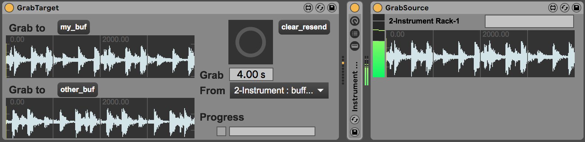
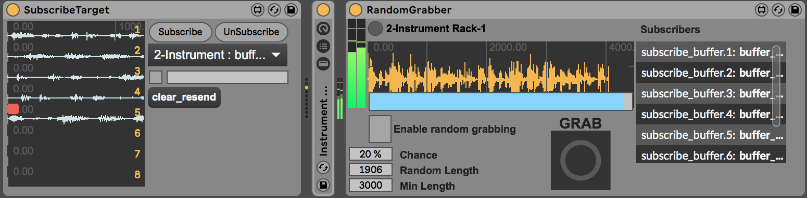

# grab.network



This is a library to build up a network of things that can grab audio into buffers in interesting ways. The network has:
* Sources: these are things that can capture a bunch of audio data in some way, and pass it on to some things that are interested in it.
* Targets: these are things that would like to be given a bunch of audio at some point.

The original motivation for this was building a granular synth engine, and wanting to be able to capture audio from different channels. This meant having a device on a return channel, where I would send everything that I wanted to be captured - then the grain engine could ask for a new buffer to be grabbed. Current motivation is extending to things that can grab audio semi-autonomously, and devices can subscribe to get updates as and when they happen.

There are a collection of max patches, and then some Example Devices that show how they can be used in larger systems.

# Network
The network is based around named send/receive objects. There are two channels (which may be one too many!) with the idea that
* one is for Targets to send and Sources to listen on; This is for each Target to ask for buffers, or to subscribe to some buffer updates.
* the other is for Sources to send on, and Targets to listen to; this lets Sources broadcast their existence, and update where they are at with grabbing buffers.

Each device has an ID - this is typically generated automatically, mostly by combining the `#0` parameter with the type of device. This things are not designed to be particularly readable, although they may be a little bit helpful.

Each device can also have a name, which is human readable. Multiple devices can have the same name, although this obviously makes it hard to choose the right one.

## Example Network Messages

Asking to grab a buffer looks a bit like this:
```
{
	"from" : "buffer_src_1036",
	"id" : "buffer_src_1043",
	"action" : "grab",
	"length" : 2000.0,
	"dest_buffer" : "my_buf"
}
```
It has the ID of the device it is from, the id of the device it is to (this should have a better name than `id`). It has the action (to grab), how much and the name of the buffer it should go into.

## Regsistering

A register message tells everyone that you are ready to grab stuff (or receive it, but this is less useful at the moment).

Registering as a thing that can grab looks like this:
```
{
	"action" : "register",
	"name" : "A-GrabSource-1",
	"id" : "buffer_src_1043",
	"type" : "single_grabber"
}
```

## Simple grabbing

At the moment there are two ways of grabbing stuff. The simple way is to ask for a certain amount to be recorded into a certain buffer. The other way is to provide a set of buffers that something else can record into as and when it chooses - a subscription model.
Taking the simple version first, the example devices are GrabSource and GrabTarget.


Using GrabTarget, you can select a source in the dropdown menu. Then decide how much time you would like to grab with the numbox.

When you press the big button, it'll send out a grab request like this:
```
{
	"action" : "grab",
	"to" : "buffer_src_1068",
	"length" : 4000.0,
	"dest_buffer" : "my_buf"
}
```

Then, you'll get a message when starting, with the device that is grabbing, the length to be grabbed, the name of the buffer being grabbed into and the device it's going to.
```
{
	"from" : "buffer_src_1011",
	"action" : "starting",
	"length" : 2000.0,
	"buffer" : "my_buf",
	"to" : "buffer_src_1001"
}
```
There's a similar message with the action `recorded` at the end.

These messages are relatively certain. There are also intermittent update messages from *some* of the grabbers that tell you how far through things are. These are relatively similar, but with a `grabbing` field (`1` or `0`) and a `grab_proportion` field. This is not really how things should be, so it'll get changed at some point.
```
{
	"from" : "buffer_src_1011",
	"action" : "update",
	"grabbing" : 1,
	"grab_proportion" : 0.765,
	"buffer" : "my_buf",
	"to" : "buffer_src_1001"
}
```

## Subscription grabbing

Subscription grabbing means saying "here's a bunch of buffers, put stuff in them as and when you feel like it.". The examples are
* SubscribeTarget, which has 8 buffers that can be grabbed into
* RandomGrabber, that maintains a list of subscribers, and grabs stuff for them at random times, for random lengths.

They look a bit like this:


The `starting`, `recorded` and `update` messages are similar. The only new message is one to subscribe with a buffer. A `subscribe` message looks like this:
```
{
	"from" : "buffer_src_1012",
	"action" : "subscribe",
	"to" : "buffer_src_1001",
	"dest_buffer" : "subscribe_buffer.8"
}
```
There is a complementary one for `unsubscribe` to stop your buffers being available.
